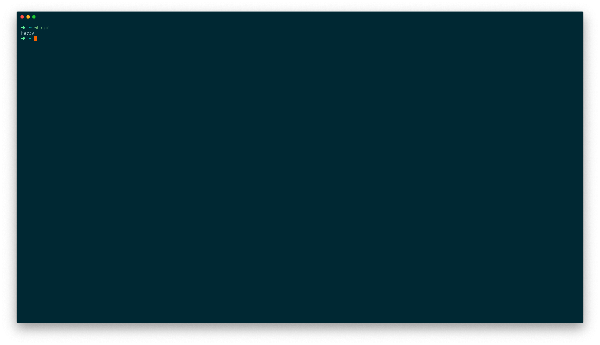

# Solarized Dark theme (high contrast) with no Navigation Bar for Hyper

A port of the [Solarized Dark High Contrast](https://github.com/roccozanni/hyper-solarized-dark-highcontrast) theme for [Hyper.app](https://hyper.is) based on [Indrashish Ghosh](https://github.com/Ghosh) awesome work on the [Solarized Dark](https://github.com/Ghosh/hyper-solarized-light) theme



### Installation
1. Open Hyper's preferences by pressing `Cmd + ,`.
2. Find and Update the plugins array to include `hyper-solarized-dark-highcontrast-no-navbar`:
  ```js
  plugins: [
    'hyper-solarized-dark-highcontrast-no-navbar'
  ],
  ```
3. Reload Hyper by pressing `Cmd + Shft + R`


### Related
- [Solarized Light Theme](https://github.com/Ghosh/hyper-solarized-light)
- [Solarized Dark Theme](https://github.com/Ghosh/hyper-solarized-dark)

```
License - MIT
```
